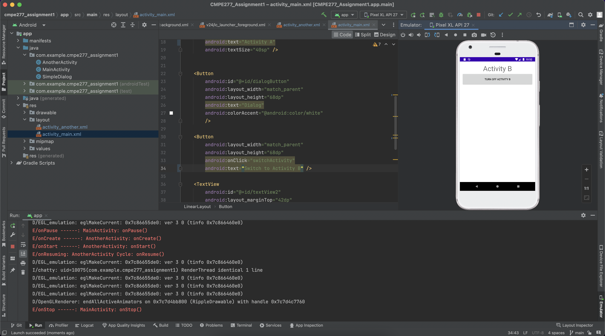
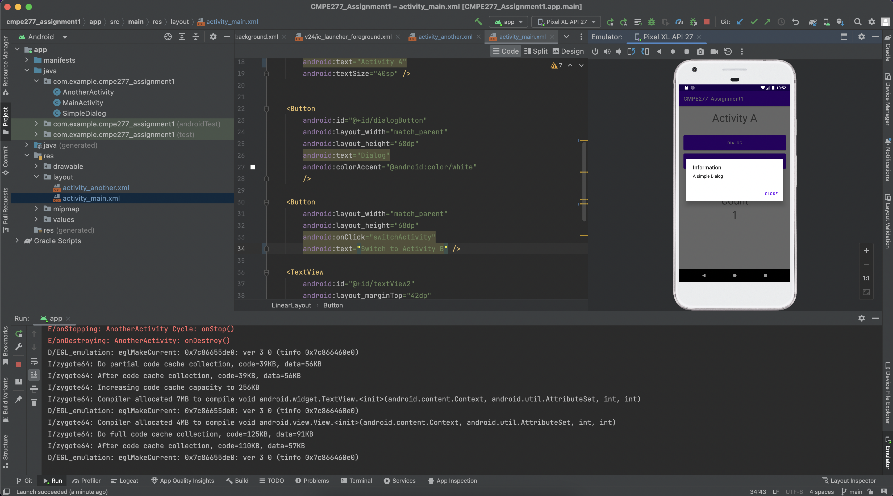
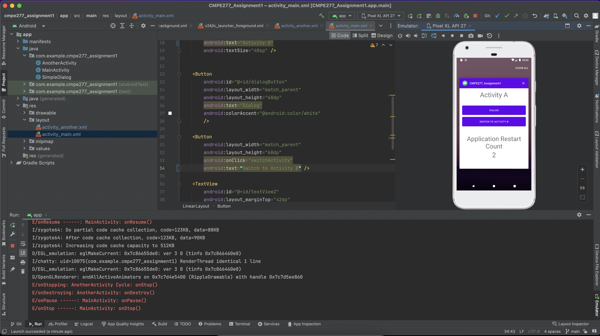
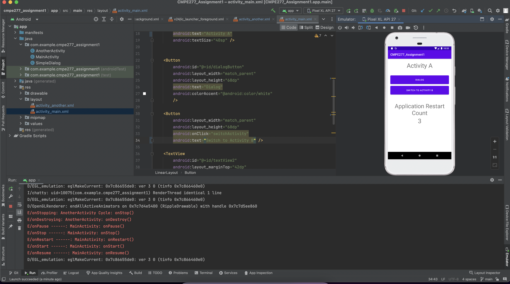

<b>Course Name :</b> Smartphone application development-assignment1

**Learning Objective**: The purpose of the app is to understand the activity life cycle and the role of Android OS plays in handling life cycle events.

### Main Activity:

### Activity B:

### Dialog Activity:

### Restart Count:

